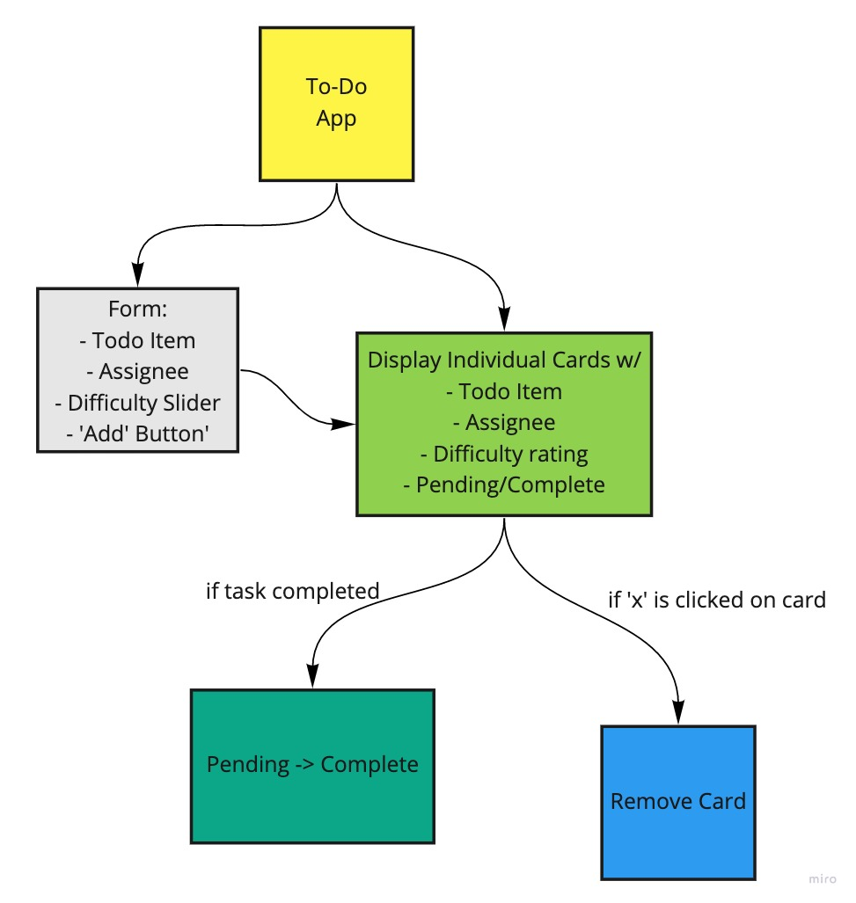

<h1 align="center">Welcome to To-Do App 👋</h1>
<p>
  
  <a href="https://github.com/markjackson28/todo-app#readme" target="_blank">
    
  </a>
  <a href="https://github.com/markjackson28/todo-app/graphs/commit-activity" target="_blank">
    
  </a>
</p>

> Using the React &#34;Context API&#34; we can create an manage state in a more &#34;global&#34; fashion, making state that matters to your entire application easily available to ... your entire application.

### 🏠 [Homepage](https://github.com/markjackson28/todo-app#readme)

## Install

```sh
npm install
```

## Usage

```sh
npm run start
```

## Run tests

```sh
npm run test
```

## Author

👤 **Mark Thanadabouth**

* Github: [@markjackson28](https://github.com/markjackson28)

## Collaborators

👤 **Lorenzo Ortega**
👤 **Jeremy Brazell**

## UML



## Lab Requirements

### Phase 1: Incorporate configuration settings to the application

In Phase 1, we’re going to perform some refactoring of the To Do application as built by another team. This application mixes application state and user settings at the top level and passes things around. It was a good proof of concept, but we need to make this production ready.

- Style the application using the Blueprint Component API{target:_blank}

- Properly modularize the application into separate components

- Implement the Context API to make some basic application settings available to components

  - How many To Do Items to show at once
  - Whether or not to show completed items

### Phase 2: Incorporate configuration settings to the application

In Phase 2, we’re going to extend the functionality of our application by allowing the user to make some decisions on how they would like the application to function. Specifically, we’ll let them make changes to 2 settings.

- Implement the Context API to make some basic application settings available to components
  - How many To Do Items to show at once
  - Whether or not to show completed items
- Provide the users with a form where they can change the values for those settings
  - This should be given in the form of a new component, perhaps linked to from the main navigation
  - Hint: Use Browser Router to create the page/route/component for this
- Save the users choices in Local Storage
- Retrieve their preferences from Local Storage and apply them to the application on startup

### Phase 3: Adding security and access controls to the application

In this final phase, we’ll be requiring that users be logged in, in order to see the to do items. Additionally, based on their user type, they will be allowed (or denied) to perform actions such as editing or deleting them.

- As a user, I want to provide a way for other users to create new accounts
- As a user, I want to provide a way for all users to login to their account
- As a user, I want to make sure that my To Do items are only viewable to users that have logged in with a valid account.
- As a user, I want to ensure that only fellow users that are allowed to “create”, based on their user type, can add new To Do Items
- As a user, I want to ensure that only fellow users that are allowed to “update”, based on their user type, can mark To Do Items complete
- As a user, I want to ensure that only fellow users that are allowed to “delete”, based on their user type, can delete new To Do Items

### Phase 4: Integrating with a live API

In this final phase, we’ll be requiring that users be logged in through a live authentication server, in order to see the to do items. Additionally, based on their user type, they will be allowed (or denied) to perform actions such as editing or deleting them. All To Do items will be stored in a database, accessed through a deployed API.

Alter the Add, Toggle Complete, and Delete functions within your to do application to use your API instead of in memory state.
- Fetch the current list of items from the database on application start
- Whenever you add/update/delete an item, refresh the state so the user can instantly see the change
  - Consider: Do you re-fetch from the server every time you make a change?
    - If so, how?
    - If not, how will you stay in sync?
Alter the Login Context to use the server to login users instead of our mock users list.
  - Be sure to store the token in state as well as in a cookie so you can reference it later.

### Resources

[How to deploy to gh-pages](https://medium.com/mobile-web-dev/how-to-build-and-deploy-a-react-app-to-github-pages-in-less-than-5-minutes-d6c4ffd30f14)

## Show your support

Give a ⭐️ if this project helped you!

***
_This README was generated with ❤️ by [readme-md-generator](https://github.com/kefranabg/readme-md-generator)_
